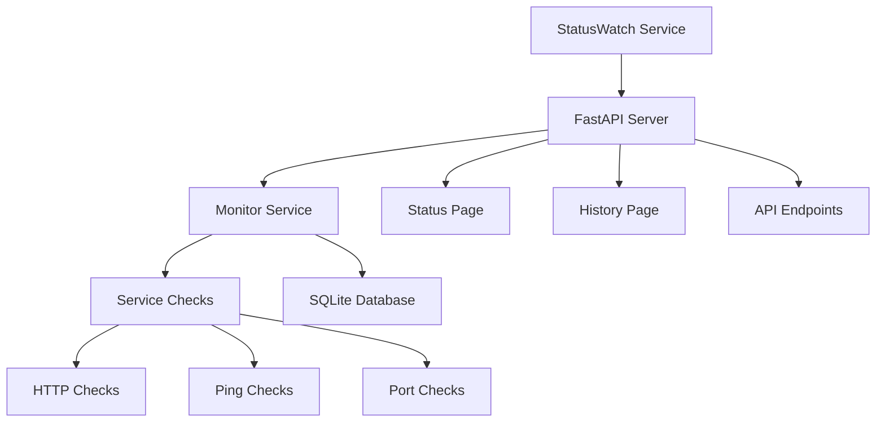
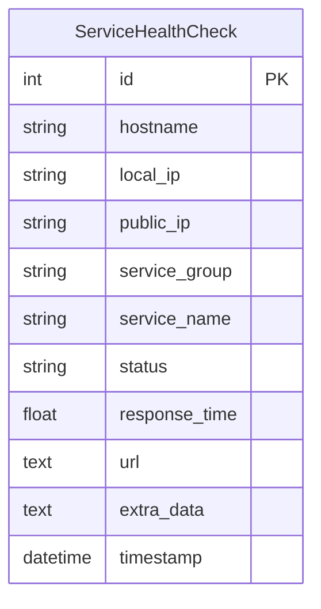
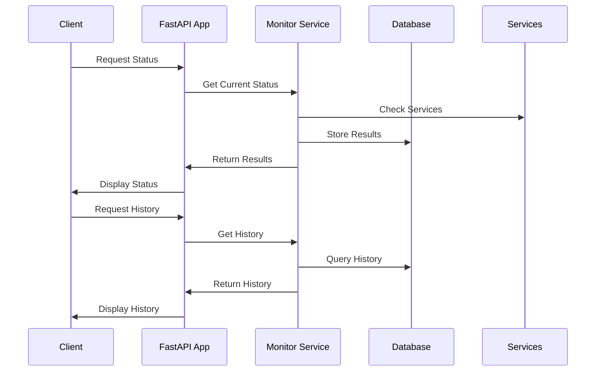

<div align="center">
  <h1>StatusWatch</h1>
  <p>A modern, FastAPI-powered status page with unified monitoring capabilities</p>
</div>

## Architecture



## Features

- 🚀 Async monitoring with FastAPI
- 📊 Unified monitoring system
- 🔍 Multiple check types (HTTP, Ping, Port)
- 📈 Time-series history tracking
- 🌐 RESTful API endpoints
- 📱 Responsive web interface
- 🔄 Real-time status updates
- 📊 Uptime calculations
- 🎯 Service grouping
- ⏰ Configurable check intervals
- 🔍 Detailed error inspection
- 📊 Interactive charts
- 🌓 Dark mode support
- ⚡ Performance optimizations
- 🔄 Configurable auto-refresh
- 📱 Mobile-first design

## Quick Start

### Using Python

1. Clone the repository:
```bash
git clone https://github.com/yourusername/StatusWatch.git
cd StatusWatch
```

2. Install dependencies:
```bash
pip install -r requirements.txt
```

3. Configure your environment:
```env
MONITOR_CONTINUOUSLY=True
CHECK_INTERVAL=30
MAX_HISTORY_ENTRIES=100
LOG_LEVEL=INFO
PRIMARY_DATABASE_URL=sqlite:///path/to/your/database.db
```

4. Configure your services in `checks.yaml`:
```yaml
- title: 'Infrastructure'
  checks:
    - name: Main Website
      type: http
      host: https://example.com
      expected_code: 200

    - name: Database
      type: port
      host: db.example.com
      port: 5432
```

5. Run the server:
```bash
python run.py
```

## Database Schema



## API Endpoints

| Endpoint | Method | Description | Parameters |
|----------|--------|-------------|------------|
| `/api/status` | GET | Current status of all services | None |
| `/api/history` | GET | Historical data for all services | `hours` (default: 24) |
| `/api/history/{group_name}` | GET | Historical data for a group | `hours` (default: 24) |
| `/api/reset-db` | POST | Reset the database | None |

## Check Types

### HTTP Check
```yaml
- name: Website
  type: http
  host: https://example.com
  expected_code: 200
  ssc: false  # Self-signed certificate
```

### Ping Check
```yaml
- name: Server
  type: ping
  host: server.example.com
```

### Port Check
```yaml
- name: Database
  type: port
  host: db.example.com
  port: 5432
```

## Data Flow



## Configuration Options

| Setting | Description | Default |
|---------|-------------|---------|
| `MONITOR_CONTINUOUSLY` | Enable continuous monitoring | `True` |
| `CHECK_INTERVAL` | Seconds between checks | `30` |
| `MAX_HISTORY_ENTRIES` | Maximum history entries | `100` |
| `PRIMARY_DATABASE_URL` | Database connection URL | `sqlite:///status_history.db` |

## Development

### Project Structure
```
StatusWatch/
├── app/
│   ├── main.py           # FastAPI application
│   ├── config.py         # Configuration
│   ├── database.py       # Database models
│   └── services/
│       ├── monitor.py    # Monitoring logic
│       └── checks.py     # Check implementations
├── checks.yaml           # Service configuration
└── incidents.md          # Incident reports
```

### Running Tests
```bash
pytest tests/
```

## Browser Support
- Chrome/Edge (latest)
- Firefox (latest)
- Safari (latest)

## Changelog

### Version 1.1.0 (Latest)
- 🎨 Improved UI/UX across all pages
- 📊 Enhanced chart visualization with:
  - Different line patterns for services
  - Smaller, clearer data points
  - Better color contrast
  - Interactive tooltips
  - Zoom and pan capabilities
- 🔍 Added detailed error inspection:
  - Modal view for error details
  - Full error payload display
  - Response time tracking
  - Duration calculations
- ⚡ Performance improvements:
  - Optimized database queries
  - Added response caching
  - Better error handling
- 🎛️ Added configurable refresh intervals
- 📱 Improved mobile responsiveness
- 🌓 Enhanced dark mode support
- 🧭 Added navigation between status and history pages
- 📈 Improved history page with:
  - Time range selection
  - Service filtering
  - Better uptime calculations
  - Current failures summary
- 🔄 Added auto-refresh capabilities
- 💾 Added database reset functionality

### Version 1.0.0 (Initial Release)
- Basic status monitoring
- Service grouping
- Simple history tracking
- Basic UI
- HTTP, Ping, and Port checks
- SQLite database storage
- Basic API endpoints

## Advanced Usage

### Error Inspection
Click the "View Details" button on any failed service to see:
- Detailed error information
- Response times
- Duration of failure
- Full error payload
- Service history

### Chart Interaction
The history charts support:
- Zooming in/out
- Panning
- Service toggling
- Time range selection
- Tooltip information

### Auto-refresh Options
Configure automatic updates with intervals:
- 30 seconds
- 1 minute
- 5 minutes
- 10 minutes
- Manual refresh option

## API Response Examples

### Status Response
```json
{
  "Group 1": [
    {
      "name": "Website",
      "status": true,
      "response_time": 0.234,
      "url": "https://example.com"
    }
  ]
}
```

### History Response
```json
{
  "history": {
    "Group 1": {
      "Website": [
        {
          "x": "2024-01-01T12:00:00",
          "y": 1,
          "response_time": 0.234
        }
      ]
    }
  },
  "uptimes": {
    "Group 1": 99.9
  }
}
```

## Contributing
Contributions are welcome! Please feel free to submit a Pull Request. For major changes, please open an issue first to discuss what you would like to change.

## License
MIT License - see [LICENSE](LICENSE) for details
